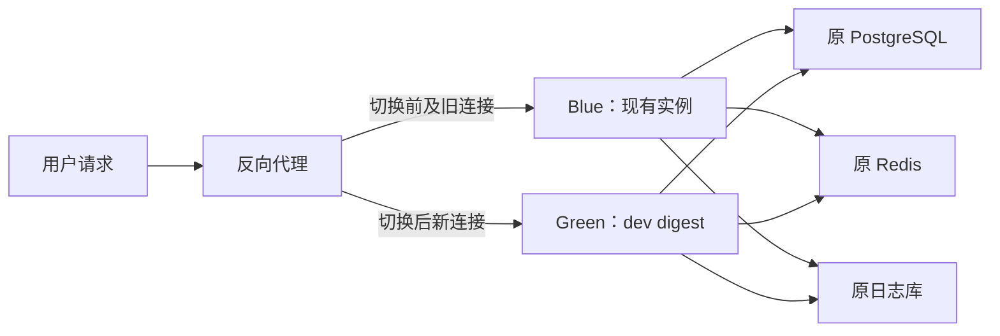

# Dev 分支最大程度无感部署方案

## 1. 目标与适用范围

将 `dev` 分支的不可变镜像替换现有上游镜像，保留原数据库、Redis、用户、Token、渠道、日志、订阅和登录状态，并把用户可感知影响压缩到反向代理的一次 graceful reload。

本文不记录服务器地址、域名、账号、密码、Token、数据库连接串、镜像仓库所有者或其他凭据。运行时配置和备份只能保存在服务器受限目录或现有密钥管理系统中。

本方案适用于以下生产拓扑：

- 主数据库为 PostgreSQL，应用容器与数据库分离。
- Redis 和数据库具有独立持久化卷，更新应用时不重建依赖服务。
- 域名流量先进入支持语法检查和 graceful reload 的反向代理。
- 可短时间并行运行两个应用容器。

若生产实际使用 SQLite，不执行本文的双实例共享数据库方案。SQLite 应改用维护窗口、停止写入、复制数据库文件、校验副本后单实例替换。

## 2. 重新分析后的当前结论

截至本次更新，`dev` 比 `main` 增加三组需要纳入部署与回滚判断的能力：

1. 注册码与注册限制。
2. 完整对话采集。
3. 订阅重复购买和管理员重复分配策略。

当前 `dev` HEAD 已包含订阅策略，但最近一次成功构建的 dev 镜像指向更早提交，不能作为本次最终发布物。必须在最终 `dev` HEAD 上重新创建 Tag 并获得新 digest。

本次新增数据库变化均为向前兼容的新增表或新增列：

- 主数据库新增 `registration_codes`、`registration_code_usages`。
- 日志数据库新增 `conversation_logs`；未配置独立日志库时，该表位于主数据库。
- `subscription_plans` 新增 `repeat_purchase_mode`，旧套餐默认 `independent`。
- `user_subscriptions` 新增 `allocation_count`，历史记录回填为 `1`。

旧镜像能够忽略这些新增结构，因此未启用新业务行为前可以只回滚应用，不回滚数据库。

## 3. 发布前必须修复的 CI 门禁

当前仓库的 `dev-*` Tag 不只触发 `.github/workflows/dev-image.yml`，还会命中其他工作流的通配 Tag：

- `release.yml` 的 `'*'`。
- `docker-build.yml` 的 `'*'`。

历史运行已经验证同一个 dev Tag 会同时触发 dev 镜像、正式 Release 和 Docker Hub 构建。这与“只由 dev Tag 构建 dev 镜像”的目标不一致。

创建下一枚发布 Tag 前必须：

1. 在 `release.yml` 的 Tag 规则中排除 `dev-*`。
2. 在 `docker-build.yml` 的 Tag 规则中排除 `dev-*`。
3. 保留 `dev-image.yml` 的 `dev-*` 规则和“Tag 必须指向远端 dev HEAD”校验。
4. 推送一个新的测试 Tag，确认只有 `Publish dev image to GHCR` 被触发。
5. 不复用、不强制移动已经存在的 Tag。

推荐 Tag 格式：

```text
dev-YYYYMMDD-HHMM-<short-sha>
```

发布物只使用工作流输出的镜像 digest：

```text
ghcr.io/<owner>/new-api@sha256:<digest>
```

不得部署浮动 Tag，也不得使用最近一次旧 dev 镜像代替当前 HEAD。

## 4. 总体拓扑



Blue 与 Green 必须复用：

- 完全相同的主数据库和日志数据库连接目标。
- 完全相同的 Redis。
- 完全相同的 `SESSION_SECRET`、Cookie 安全配置和业务环境变量。
- 完全相同的外部回调域名。

Blue 与 Green 必须使用：

- 不同的容器名、`NODE_NAME`、本机端口和日志目录。
- 仅监听 `127.0.0.1` 的 Green 端口，禁止增加公网入口。
- 相同的应用 Docker 网络。

生产使用外部 PostgreSQL 时，Green 使用独立的临时 `/data` 目录即可，避免两个实例清理同一磁盘缓存。不得误挂一个新的空数据库卷。

## 5. Compose 使用约束

仓库根目录的 `docker-compose.yml` 同时定义应用、PostgreSQL 和 Redis，并固定了 `container_name`。直接以新 project name 再启动该文件可能造成容器名冲突，或创建一套新的空数据库和 Redis；仅使用镜像 override 也只会原地重建现有应用，不是蓝绿部署。

因此 Green 必须使用“仅包含应用服务”的独立 Compose 文件，结构如下：

```yaml
services:
  new-api-green:
    image: ${NEW_API_IMAGE_DIGEST}
    container_name: new-api-green
    restart: unless-stopped
    command: --log-dir /app/logs
    env_file:
      - ./runtime.env
    ports:
      - "127.0.0.1:${GREEN_PORT}:3000"
    volumes:
      - ./green-data:/data
      - ./green-logs:/app/logs
    networks:
      - app-network

networks:
  app-network:
    external: true
    name: ${EXISTING_APP_NETWORK}
```

该文件只表达拓扑，实际变量由服务器受限环境文件提供。`runtime.env` 不进入 Git，不复制到发布文档，不在命令输出中打印。

禁止执行：

```text
docker compose down
docker compose down -v
docker volume rm
docker system prune --volumes
```

## 6. 上线门禁

以下条件必须全部满足：

1. CI Tag 冲突已经排除，新的 dev Tag 只触发 dev 镜像工作流。
2. Tag 指向远端 `dev` HEAD，工作流成功并输出多架构 digest。
3. 本地完整测试、Default/Classic 构建和订阅 API 端到端测试通过。
4. 生产服务器能够按 digest 拉取 GHCR 镜像。
5. 主数据库和独立日志数据库均已完成在线一致性备份与恢复演练。
6. 新镜像已在恢复副本上成功完成迁移并启动。
7. 恢复副本上的用户、Token、渠道、订阅、日志数量与备份快照一致。
8. 迁移只出现本文列出的新增表、列和回填。
9. CPU、内存、磁盘和数据库连接数允许短时间运行 Blue 与 Green。
10. 已准备并验证反向代理回滚配置。

任一门禁失败，停止发布，不连接生产数据库，不切换流量。

## 7. 备份与恢复演练

### 7.1 备份范围

每次发布创建独立且权限受限的目录：

```text
pre-dev-<timestamp>/
├── main-database.dump
├── main-database.dump.sha256
├── log-database.dump
├── log-database.dump.sha256
├── compose-config/
├── proxy-config/
└── persistent-data.tar.gz
```

要求：

- 主库使用 PostgreSQL custom format 在线备份。
- 若 `LOG_SQL_DSN` 指向独立 PostgreSQL/MySQL，单独备份日志库。
- 若日志库是 ClickHouse，使用其原生备份方案；完整对话采集当前不支持 ClickHouse，部署后继续保持关闭。
- 保存并验证 SHA-256，但不把 DSN 或凭据写入校验日志。
- 备份原 Compose、反向代理配置、持久化目录和当前镜像 digest。
- 配置快照可能包含凭据，目录权限必须限制为部署账号可读。

### 7.2 恢复演练

在隔离的同版本数据库实例中恢复备份，使用新镜像启动一次。检查：

- 应用健康检查通过且没有迁移循环或重复 `ALTER TABLE`。
- 新表和新列存在。
- `user_subscriptions.allocation_count` 不存在空值或小于 `1` 的值。
- 旧套餐的 `repeat_purchase_mode` 为 `independent`。
- 注册码强制开关和全局对话采集开关仍为关闭。
- 使用恢复副本完成 Root 登录和只读管理 API 检查。

恢复演练记录耗时。若生产表规模明显更大，应按演练结果预估 DDL 锁窗口，并选择低峰期发布。

## 8. 生产部署步骤

### 阶段 A：基线冻结

1. 记录 Blue 镜像 digest、容器状态、网络、挂载、端口和反向代理 upstream。
2. 确认数据库、Redis 和日志库的实际持久化位置。
3. 确认 Green 的环境变量来自 Blue 的同一受控配置源，而不是手工重写。
4. 记录核心数据基线：用户、Token、渠道、订阅计划、用户订阅和日志数量。
5. 确认以下功能在发布期间保持关闭或默认状态：

```text
RegistrationCodeRequired=false
ConversationCaptureEnabled=false
所有现有套餐 repeat_purchase_mode=independent
```

### 阶段 B：启动 Green 并迁移

1. 按 digest 拉取镜像。
2. 使用应用专用 Compose 文件启动 Green，不启动 PostgreSQL 或 Redis 服务。
3. Green 保持 master 模式，使启动过程执行 GORM 迁移；不要设置 `NODE_TYPE=slave`，否则会跳过迁移。
4. Green 只绑定本机端口，Blue 继续承载全部公网流量。
5. 等待健康检查稳定，再检查启动日志中迁移已结束且容器没有重启。

Blue 与 Green 在验证和排空期间会短时间同时作为 master。系统任务已有主节点判断或数据库协调，但仍应把并行窗口控制在验证和连接排空所需的最短时间，不把两个实例同时运行 24 小时。

### 阶段 C：Green 直连验证

至少完成：

- `GET /api/status` 和两个前端主题静态资源正常。
- 使用受限的内部 canary 入口完成 Root 登录，管理端只读 API 正常。
- 使用专用测试 Token 完成一次最小非流式和一次流式请求。
- 现有用户、Token、渠道、订阅计划和用户订阅可读取。
- PostgreSQL、Redis、日志库连接正常。
- 新增表、列及历史回填正确。
- 注册码、对话采集和非独立订阅策略仍未启用。
- 无持续锁等待、迁移错误、容器重启或异常资源增长。

测试 Token 只能从服务器密钥源注入，禁止粘贴到命令行历史、文档或日志。

### 阶段 D：平滑切流

1. 生成只把 upstream 从 Blue 本机端口改为 Green 本机端口的候选配置。
2. 查看完整 diff，确认没有域名、TLS、WebSocket、SSE 超时或请求体限制的其他变化。
3. 对候选配置执行反向代理语法检查。
4. 自动备份当前配置。
5. 执行 graceful reload，不重启反向代理容器。

reload 后新请求进入 Green；旧代理 worker 和 Blue 继续处理切换前已建立的流式连接。

### 阶段 E：切流后验证

立即检查：

- 已登录浏览器刷新后仍保持登录，验证 `SESSION_SECRET` 和 Cookie 配置一致。
- Root、普通用户页面和管理 API 正常。
- 最小非流式、流式请求成功，额度和日志各产生一次正确记录。
- 支付回调地址仍指向原域名，待处理订单没有异常。
- `499`、`502`、`504`、5xx 和 P95/P99 延迟无明显变化。
- 数据库连接数、锁等待、慢查询和 Redis 错误正常。

### 阶段 F：排空 Blue

1. 反向代理不再向 Blue 分发新请求。
2. 监控 Blue 活动连接和 SSE 日志，至少等待一个最长请求超时周期。
3. 确认 Blue 无活动请求后优雅停止容器，但不要删除容器、镜像或配置。
4. 保留已停止的 Blue 和原代理配置至少 24 小时作为快速回滚入口。

“保留旧实例”指保留可重新启动的容器和镜像，不是让 Blue 与 Green 作为两个 master 持续运行 24 小时。

## 9. 功能启用顺序

应用稳定运行至少 24 小时且快速回滚窗口结束前，不启用新业务行为。

### 9.1 订阅重复策略

1. 先确认历史套餐均为 `independent`。
2. 只选择一个低风险套餐作为 canary。
3. 根据业务选择时间、额度、时间加额度或覆盖策略。
4. 完成一次真实或受控购买，核对有效期、额度、`allocation_count` 和购买上限。
5. 观察无异常后再逐套餐启用。

一旦发生合并购买，旧镜像虽然仍能读取合并后的订阅，但会按“记录条数”而不是 `allocation_count` 计算购买次数。此后回滚旧镜像前应先暂停受影响套餐购买，避免购买上限被低估。

### 9.2 注册码限制

1. 先生成并验证足够的有效注册码。
2. 分别验证密码注册、OAuth 注册和目标第三方注册入口。
3. 确认现有用户登录不受影响。
4. 最后开启 `RegistrationCodeRequired`。

回滚旧镜像前先关闭注册码强制限制，因为旧镜像不会执行该限制。

### 9.3 完整对话采集

1. 确认日志库为 SQLite、MySQL 或 PostgreSQL；ClickHouse 不启用。
2. 先配置保留天数和最大存储量。
3. 只给一个 canary 渠道开启渠道采集开关。
4. 再开启全局 `ConversationCaptureEnabled`。
5. 验证非流式、流式、错误响应、截断标记、清理任务和磁盘增长。
6. 根据存储和隐私要求逐渠道扩大。

应用部署、订阅策略、注册码限制和对话采集必须作为四个独立变更执行。

## 10. 监控与回滚

### 10.1 监控项

- 反向代理 `499`、`502`、`504`。
- API 5xx、P95/P99 和流式异常结束数量。
- Green CPU、内存、重启次数和磁盘增长。
- PostgreSQL锁等待、连接数、慢查询和表膨胀。
- Redis 连接错误和缓存异常。
- 用户、Token、渠道、订阅数量。
- 额度扣减、订阅消费、支付订单和消费日志。
- 对话采集启用后的日志库存储增长和清理任务结果。

### 10.2 回滚矩阵

| 阶段 | 回滚动作 | 数据库处理 |
| --- | --- | --- |
| 切流前 | 停止 Green，Blue 不变 | 不恢复 |
| 切流后、未启用新功能 | upstream 切回 Blue，graceful reload | 不恢复 |
| 已启用注册码 | 先关闭强制限制，再切回 Blue | 不恢复 |
| 已启用对话采集 | 先关闭全局采集，再切回 Blue | 保留已采集记录 |
| 已发生订阅合并 | 暂停受影响套餐购买，再切回 Blue | 保留订阅，人工关注购买上限 |
| 确认数据库损坏 | 进入停写、差异核对和恢复流程 | 按批准的恢复方案处理 |

正常应用回滚不得恢复发布前数据库备份，因为那会删除发布后产生的用户、订单、额度和日志数据。

## 11. 发布完成标准

全部满足后才认定完成：

- Green 经域名入口稳定运行至少 24 小时。
- Blue 已排空并停止，且没有客户端绕过代理直连旧端口。
- 已登录 Session、计费、订阅、支付回调和流式请求无异常。
- 数据核对无减少，新增迁移结构符合预期。
- 正式部署配置已记录当前镜像 digest、端口和回滚 digest。
- 数据库备份、恢复记录和代理配置备份仍可用。
- 新功能仍按独立变更逐项灰度，而不是随部署同时全量开启。

## 12. 执行前最终检查表

```text
[ ] release.yml 与 docker-build.yml 已排除 dev-*
[ ] 新 Tag 指向远端 dev HEAD
[ ] 只有 dev-image.yml 被触发且构建成功
[ ] 已记录不可变镜像 digest
[ ] 主库与日志库备份、校验、恢复演练通过
[ ] 恢复副本迁移和数据核对通过
[ ] Green 使用应用专用 Compose，不会启动新数据库/Redis
[ ] Green 复用原 SESSION_SECRET、数据库、Redis 和 Cookie 配置
[ ] Green 仅监听 127.0.0.1
[ ] 三类新功能保持关闭或 independent
[ ] Green 直连健康、登录、非流式、流式验证通过
[ ] 代理候选配置 diff 与语法检查通过
[ ] 回滚 upstream 和旧镜像已就绪
[ ] 切流后验证通过并完成 Blue 排空
```
