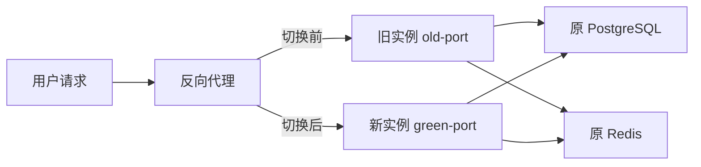

# Dev 分支最大程度无感部署方案

## 1. 目标与边界

将 `dev` 分支构建的不可变镜像部署到现有生产环境，同时满足：

- 不重建数据库、Redis 或持久化卷。
- 保留现有用户、Token、渠道、日志和登录状态。
- 新实例验证完成前，旧实例持续提供服务。
- 通过反向代理平滑切换新请求，旧实例继续处理切换前的长连接。
- 注册码限制和对话采集首次部署后保持关闭，待应用稳定后单独启用。

本文只使用占位符，不记录服务器地址、域名、密码、Token、数据库连接串或其他凭据。

## 2. 发布物生成规则

镜像工作流只接受 `dev-*` Git Tag 的 push 事件，不响应普通分支 push 和手动触发。

发布顺序：

1. 将待发布提交推送到远端 `dev`。
2. 在 `dev` 最新提交上创建一个新的 `dev-*` Tag。
3. 推送该 Tag。
4. 工作流校验 Tag 指向的提交必须与远端 `dev` HEAD 完全一致。
5. 构建并推送多架构镜像，生产部署只使用工作流输出的镜像 digest。

示例 Tag：

```text
dev-YYYYMMDD-<short-sha>
```

不得复用或强制移动已经发布的 Tag。

## 3. 架构



旧实例和绿色实例复用相同数据库、Redis、Session 密钥和业务配置，但使用不同容器名称、节点名称、端口和日志目录。

## 4. 上线门禁

以下条件必须全部满足：

1. GitHub Actions 构建成功并输出镜像 digest。
2. 生产服务器能够读取该 GHCR 镜像。
3. PostgreSQL 完整逻辑备份已生成并通过校验。
4. 备份已在隔离的 PostgreSQL 实例中成功恢复。
5. 新镜像在恢复副本上启动成功。
6. 数据库迁移只产生预期的新增表和兼容性变更。
7. 当前磁盘、CPU、内存和数据库连接数允许短时间运行两个应用实例。

任一门禁失败，停止发布，不切换生产流量。

## 5. 备份与恢复演练

部署前创建独立的发布备份目录，包含：

```text
pre-dev-<timestamp>/
├── database.dump
├── database.dump.sha256
├── compose-config/
├── proxy-config/
└── app-data.tar.gz
```

要求：

- PostgreSQL 使用支持在线一致性快照的自定义格式备份。
- 保存数据库备份校验和并验证备份目录权限。
- 备份应用持久化目录、Compose 配置和反向代理配置。
- 在隔离的同版本 PostgreSQL 中完成一次实际恢复。
- 使用新镜像连接恢复副本，检查迁移结果和核心数据数量。

应用回滚时通常不恢复数据库，因为恢复旧备份会丢失发布后产生的新数据。只有确认数据库被破坏并完成差异核对后，才进入停写恢复流程。

## 6. 启动绿色实例

绿色实例必须：

- 使用工作流输出的镜像 digest，不使用浮动标签。
- 只监听本机绿色端口，不直接暴露新的公网入口。
- 连接原 PostgreSQL 和 Redis，不启动新的依赖服务。
- 复用原 `SESSION_SECRET`，保证现有登录状态继续有效。
- 接入原应用 Docker 网络。
- 复用应用数据目录，但使用独立日志目录。
- 使用不同 `NODE_NAME`，避免实例身份冲突。
- 保持旧实例运行，不修改旧实例端口和配置。

启动时只操作绿色应用实例，禁止执行：

```text
docker compose down
docker compose down -v
docker volume rm
```

也不得使用新的 Compose project name启动 PostgreSQL或 Redis，以免生成新的空数据卷。

## 7. 绿色实例验证

绿色实例至少连续健康 3～5 分钟后才能进入切流阶段。

验证内容：

- 容器健康状态稳定。
- 状态接口和前端资源正常。
- Root 登录正常，已有 Session 不失效。
- 现有用户、Token、渠道和日志数量没有减少。
- 使用专用测试 Token 完成一次最小非流式请求和一次流式请求。
- PostgreSQL、Redis 连接正常。
- 新增表存在，旧表结构和数据正常。
- 无持续迁移错误、锁等待、容器重启或异常资源增长。

首次上线保持以下配置关闭：

```text
RegistrationCodeRequired=false
ConversationCaptureEnabled=false
```

应用部署和业务开关启用必须拆成两个独立变更。

## 8. 平滑切流

将反向代理中指向旧端口的应用 upstream 改为绿色端口，并使用现有配置发布工具执行：

1. 生成候选配置。
2. 查看完整 diff。
3. 确认 diff 只包含目标 upstream 变化。
4. 对候选配置执行语法检查。
5. 自动备份当前配置。
6. graceful reload。

graceful reload 后，新请求进入绿色实例，切换前已建立的连接继续由旧代理 worker 和旧实例处理。

不得直接重启反向代理容器。

## 9. 旧实例排空

切流后：

1. 旧实例继续运行至少一个最长请求超时周期。
2. 监控旧端口活动连接、SSE 请求和错误日志。
3. 只有旧端口连续一段时间无活动连接，才能停止旧实例。
4. 建议保留旧实例 24 小时作为快速回滚入口。

若旧端口仍对公网开放，应先确认没有客户端绕过域名直接访问。存在直连用户时，旧实例不得立即退役；应先迁移客户端或增加稳定的四层代理。

旧实例退役前不得启用注册码强制限制，否则旧入口可能绕过新规则。

## 10. 监控与回滚

切流后持续观察：

- 反向代理 `499`、`502`、`504`。
- API 5xx 比例和 P95/P99 延迟。
- SSE 异常结束数量。
- 新实例 CPU、内存和重启次数。
- PostgreSQL锁等待、连接数和慢查询。
- 用户、Token、渠道数量。
- 额度扣减、订阅消费和消费日志。

出现健康检查失败、5xx 明显增加、计费异常、数据数量减少、持续数据库锁等待或流式响应异常时，立即把 upstream 切回旧端口并 graceful reload。

新增表对旧镜像保持兼容，因此应用回滚通常不需要数据库回滚。

## 11. 发布完成标准

满足以下条件后才能认定发布完成：

- 域名入口稳定运行绿色实例至少 24 小时。
- 旧端口已排空或已确认不存在直连用户。
- 新旧数据核对一致。
- 未发现登录失效、计费、额度或流式请求异常。
- 正式 Compose 已记录镜像 digest 和当前运行拓扑。
- 回滚镜像、数据库备份和代理配置备份仍可用。

完成应用发布后，再分别灰度启用注册码限制和对话采集。
